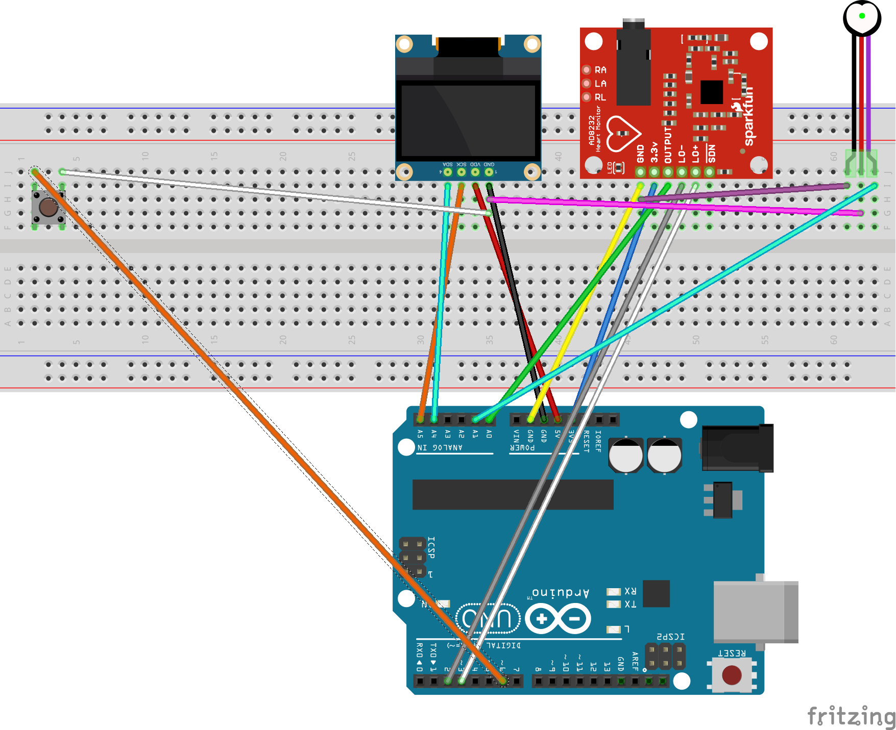
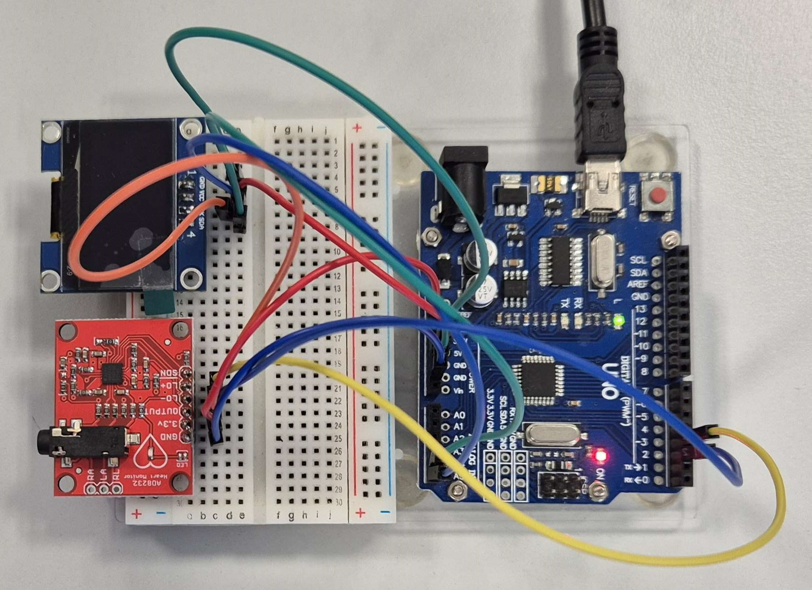
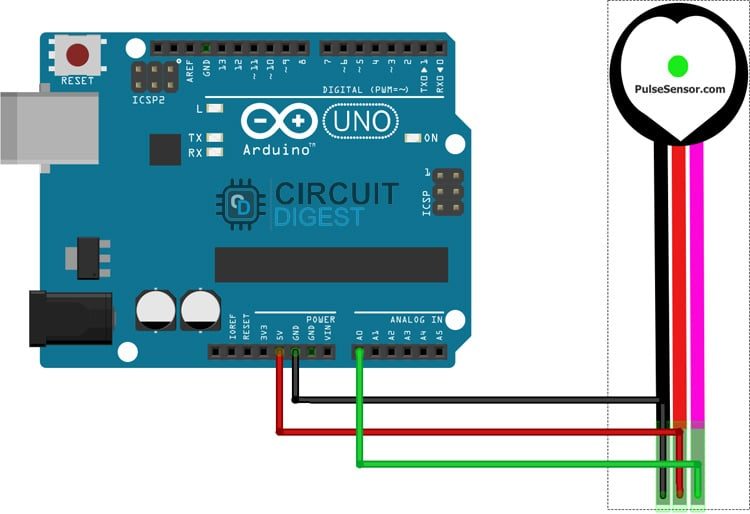

<!-- prevent jekyll yaml parsing -->

  **Vysoké učení technické v Brně, Fakulta elektrotechniky a komunikačních technologií, Ústav radioelektroniky, 2025/2026**  

---

# Systém pro zobrazení EKG a PPG signálu a měření tepové frekvence. 

---

# 📚 Obsah

1. [Členové týmu](#clenove-tymu)
2. [Popis projektu](#popis-projektu)
3. [Výpočet BPM](#vypocet-bpm)
4. [⚙️ Funkční bloky systému](#funkcni-bloky-systemu)
5. [🔌 Hardware](#hardware)
6. [🎚️ Zapojení](#zapojeni)
7. [🛠️ Hardware design](#hardware-design)
8. [⚙️ Funkce systému](#funkce-systemu)
9. [🔍 Jak to funguje uvnitř](#jak-to-funguje-uvnitr)
10. [📂 Hlavní soubory](#hlavni-soubory)
11. [🎥 Video ukázka](#video-ukazka)
12. [Poznámky](#poznamky)
13. [📜 Autoři použitých knihoven](#autori-knihoven)
14. [Licence](#licence)

---

<a id="clenove-tymu"></a>
## 👥 Členové týmu

- **Tomáš Běčák** – Odpovědný za GitHub, implementace AD8232 driveru, spoluautor `main.c`  
- **Mykhailo Krasichkov** – Spoluautor posteru, spoluautor PPG driveru, spoluautor `main.c`  
- **Daniel Kroužil** – Spoluautor posteru, spoluautor PPG driveru, GitHub spoluadministrace, spoluautor `main.c`

<a id="popis-projektu"></a>
## 📝 Popis projektu

Projekt realizuje přenosný **EKG/PPG monitor** založený na mikrokontroléru **ATmega328P (Arduino UNO)**.  
Systém umožňuje:

- snímat EKG signál modulem **AD8232**
- snímat optický PPG signál senzorem **HW-827**
- zobrazit waveform v reálném čase na **OLED SH1106 (128×64)**
- počítat tepovou frekvenci (BPM) pro oba režimy
- přepínat EKG ↔ PPG tlačítkem
- detekovat odlepení elektrod (LO+/LO–)

Firmware je napsaný **v čistém C**, bez Arduino frameworku.  
Veškeré vykreslování probíhá přes I2C/TWI knihovnu.

<a id="vypocet-bpm"></a>
## 🧮 Výpočet tepové frekvence (BPM)

Systém počítá BPM zvlášť pro EKG i PPG.

### EKG (AD8232)
- detekce R-špiček pomocí jednoduchého adaptivního prahu  
- ukládá časy posledních detekcí  
- BPM se počítá:  

$BPM = \frac{60000}{\Delta t_{RR}}$

kde $\Delta t_{RR}$ je rozdíl dvou R-peak časů v milisekundách.

### PPG (HW-827)
- signál je filtrován (EMA + noise reduction)  
- pro zvýšení efektivní vzorkovací frekvence se měří více vzorků mezi refreshi displeje  
- adaptivní detekce peaků  
- z IBI (inter-beat interval) se počítá BPM podobně jako u EKG

---

<a id="funkcni-bloky-systemu"></a>
## ⚙️ Funkční bloky systému

| Blok | Funkce |
|------|---------|
| **AD8232** | EKG snímač, analogová filtrace, LO+/LO– detekce |
| **PPG senzor (HW-827)** | Optické snímání průtoku krve, filtr + BPM algoritmus |
| **ATmega328P** | ADC převod, řízení režimů, výpočet BPM, filtrace |
| **OLED SH1106** | Kreslení waveformu a BPM v reálném čase |
| **Tlačítko** | Přepínání EKG ↔ PPG režimu |
| **Napájení** | 5 V (Arduino), 3.3 V pro AD8232 |

---

<a id="hardware"></a>
## 🔌 Hardware

Použité komponenty
- Arduino UNO (ATmega328P)
- AD8232 EKG modul
- HW-827 PPG senzor
- OLED 128×64 SH1106 (I2C)
- Tlačítko přepínání režimu

---

<a id="zapojeni"></a>
## 🎚️ Zapojení

| Arduino | AD8232 |
|------|---------| 
| 3V3 | 3.3V | 
| GND | GND | 
| A0 | OUTPUT | 
| D2 | LO- | 
| D3 | LO+ | 

| Arduino | SH1106 | 
|------|---------| 
| 5V | VCC | 
| GND | GND | 
| A5 | SCK | 
| A4 | SDA |

| Arduino | HW-827/PPG senzor | 
|------|---------| 
| GND | GND | 
| 5V | VCC | 
| A1 | Signal |

| Arduino | Mikrospínač | 
|------|---------| 
| GND | Pravá horní nožička a levá horní nožička | 
| D6 | Pravá dolní nožička a levá dolní nožička | 


Níže je kompletní zapojení systému (Arduino UNO + AD8232 + PPG senzor + OLED SH1106 + mikrospínač):

<p align="center">
  
</p>

---

<a id="hardware-design"></a>
## 🛠️ Hardware design



Obr. 1 Propojení



Obr. 2 Propojení HW-827 s piny desky Arduino UNO *(zdroj: [DevXplained](https://devxplained.eu/en/blog/heart-rate-module-part-1))*


Obr. 3 Propojení AD8232 s piny desky Arduino UNO *(zdroj: [Microcontrollers Lab](https://microcontrollerslab.com/ad8232-ecg-module-pinout-interfacing-with-arduino-applications-features/))*

---

<a id="funkce-systemu"></a>
## ⚙️ Funkce systému

- **EKG režim**
  - ADC čtení z A0
  - kontrola odlepení elektrod přes LO+/LO–
  - filtrování + adaptivní baseline
  - detekce R-špiček → výpočet BPM

- **PPG režim**
  - čtení z A1
  - digitální filtrace + oversampling
  - detekce pulsů → výpočet BPM
  - zvětšený vertikální zoom pro lepší čitelnost

- **OLED SH1106**
  - vykreslení waveformu (lineární spojnice)
  - zobrazení BPM
  - blikající srdce jako indikátor detekce beatů
  - úvodní animace „EKG / PPG Monitor“

---

<a id="jak-to-funguje-uvnitr"></a>
## 🔍 Jak to funguje uvnitř?

### Hlavní program (`main.c`)
➡️ [Otevřít main.c](https://github.com/256-514/DE2-Project-EKG/blob/main/src/main.c)
- inicializace všech modulů  
- přepínání režimů  
- řízení ADC  
- vykreslování na OLED  
- volání BPM algoritmů  

### EKG driver (`ad8232.c`)
➡️ [Otevřít ad8232.c](https://github.com/256-514/DE2-Project-EKG/blob/main/lib/ad8232/ad8232.c)  
➡️ [Otevřít ad8232.h](https://github.com/256-514/DE2-Project-EKG/blob/main/lib/ad8232/ad8232.h)
- LO+ / LO– logika  
- čtení ADC0  

### BPM logika (`bpm.c`)
➡️ [Otevřít bpm.c](https://github.com/256-514/DE2-Project-EKG/blob/main/lib/bpm/bpm.c)  
➡️ [Otevřít bpm.h](https://github.com/256-514/DE2-Project-EKG/blob/main/lib/bpm/bpm.h)
- detekce R-peaks  
- výpočet BPM  

### PPG driver (`ppg_sensor.c`)
➡️ [Otevřít ppg_sensor.c](https://github.com/256-514/DE2-Project-EKG/blob/main/lib/ppg_sensor/ppg_sensor.c)  
➡️ [Otevřít ppg_sensor.h](https://github.com/256-514/DE2-Project-EKG/blob/main/lib/ppg_sensor/ppg_sensor.h)
- filtrace  
- detekce pulsů  
- BPM z IBI  

### OLED driver (`oled.c`)
➡️ [Otevřít oled.c](https://github.com/256-514/DE2-Project-EKG/blob/main/lib/oled/oled.c)  
➡️ [Otevřít oled.h](https://github.com/256-514/DE2-Project-EKG/blob/main/lib/oled/oled.h)  
➡️ [Otevřít font.h](https://github.com/256-514/DE2-Project-EKG/blob/main/lib/oled/font.h)
- grafické primitivy  
- frame buffer  
- rendering  

### TWI (`twi.c`)
➡️ [Otevřít twi.c](https://github.com/256-514/DE2-Project-EKG/blob/main/lib/twi/twi.c)  
➡️ [Otevřít twi.h](https://github.com/256-514/DE2-Project-EKG/blob/main/lib/twi/twi.h)
- I2C transport pro OLED
 
---

<a id="hlavni-soubory"></a>
## 📂 Hlavní soubory

```
/..................................................Kořenový adresář projektu
├── include/.......................................Hlavičkové soubory projektu
│   └── timer.h....................................Prototypy časovače, systémová timebase
├── lib/...........................................Knihovny
│   ├── oled/......................................Ovladač OLED displeje SH1106
│   │   ├── oled.c.................................
│   │   ├── oled.h.................................
│   │   └── font.h.................................
│   ├── twi/.......................................I2C/TWI master ovladač pro AVR
│   │   ├── twi.c..................................
│   │   └── twi.h..................................
│   ├── uart/......................................UART ovladač (Peter Fleury)
│   │   ├── uart.c.................................
│   │   └── uart.h.................................
│   ├── bpm/.......................................Výpočet BPM + detekce špiček
│   │   ├── bpm.c..................................
│   │   └── bpm.h..................................
│   ├── ad8232/....................................Ovladač EKG modulu AD8232
│   │   ├── ad8232.c...............................
│   │   └── ad8232.h...............................
│   ├── ppg_sensor/................................Ovladač PPG senzoru + BPM algoritmus
│   │   ├── ppg_sensor.c...........................
│   │   └── ppg_sensor.h...........................
├── src/...........................................Zdrojové kódy
│   └── main.c.....................................Hlavní řídicí logika systému (EKG/PPG, OLED, BPM)
└── README.md......................................Dokumentace projektu
```

### Klíčové vlastnosti firmware
- **Timer0** generuje millis() přes přerušení  
- **X-SCALE** (1–4) umožňuje roztáhnout waveform v ose X  
- **Bez Arduino frameworku** – čisté AVR C  
- **Bez dynamické paměti**, OLED používá statický buffer  
- **Debounce tlačítka softwarem**  
- **Bezpečné přepínání ADC kanálů mezi EKG a PPG**

---

<a id="video-ukazka"></a>
## 🎥 Video ukázka měření

---

## Prototyp:

<p align="center">
  
</p>

---

<a id="poznamky"></a>
## Poznámky

- nepoužívá `arduino.h`
- nepoužívá Arduino knihovny
- projekt je plně v C (AVR-GCC)

---

<a id="autori-knihoven"></a>
## 📜 Autoři použitých knihoven a licence

Projekt využívá několik knihoven třetích stran.  
Zde jsou uvedeni jejich původní autoři a licence dle hlaviček souborů.

### 🟦 TWI / I2C knihovna (`twi.c`, `twi.h`)
- **Autor:** doc. Ing. Tomáš Fryza, Ph.D.  
- **Licence:** MIT License  
- **Poznámka:** Knihovna je určena pro AVR-GCC, testovaná na Arduino Uno.  
- Zdrojové soubory obsahují copyright © 2018–2025.

### 🟦 Timer knihovna (`timer.h`)
- **Autor:** doc. Ing. Tomáš Fryza, Ph.D.  
- **Licence:** MIT License  
- **Poznámka:** Čistě hlavičková knihovna bez `.c` souboru.  
- Copyright © 2019–2024.

### 🟦 UART knihovna (`uart.c`, `uart.h`)
- **Autor:** Peter Fleury  
- **Licence:** GNU GPL v2 (GNU General Public License Version 2)  
- **Zdroj:** klasická UART knihovna pro AVR mikrokontroléry  
- Poznámka: Knihovna je velmi rozšířená a stabilní.

### 🟦 OLED SH1106 knihovna (`oled.c`, `oled.h`, `font.h`)
- **Autor:** Michael Köhler (Skie-Systems), další přispěvatelé  
- **Licence:** GNU GPL v3  
- **Poznámka:** Jedná se o knihovnu pro ovládání SSD1306/SSD1309/SH1106 displejů, podporuje GRAPHICMODE.  
- Hlavička souboru uvádí více jazykových verzí (EN/DE).

### 🟩 Vlastní kódy týmu (Běčák, Krasichkov, Kroužil)
Týká se souborů:

- `main.c`  
- `ad8232.c`, `ad8232.h`  
- `bpm.c`, `bpm.h`  
- `ppg_sensor.c`, `ppg_sensor.h`  

Tyto soubory jsou **originální dílo autorů projektu**, licencované pod vámi definovanou licencí SPL-NC (Student Project License – Non-Commercial).

---

<a id="licence"></a>
## Licence

Tento projekt je uvolněn pod licencí **SPL-NC (Student Project License – Non-Commercial)**.

### Podmínky použití:

- 📘 **Je dovoleno**:
  - používat projekt pro studijní a výukové účely,
  - upravovat zdrojové kódy,
  - vytvářet odvozené práce,
  - šířit projekt mezi studenty a akademickou veřejností,
  - odkazovat na tento projekt.

- 🚫 **Není dovoleno**:
  - používat projekt pro **komerční účely** bez předchozího písemného souhlasu autorů,
  - prodávat zařízení založená na tomto projektu,
  - využívat projekt v komerčních produktech nebo službách.

- 📎 **Podmínky**:
  - Musí být zachováno jméno autorů (Běčák, Krasichkov, Kroužil).
  - Musí být zachována tato licence.
  - Odvozené práce musí uvádět, že vychází z tohoto projektu.

### © 2025 Autoři projektu  
Tomáš Běčák, Mykhailo Krasichkov, Daniel Kroužil 
